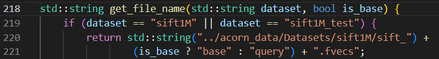
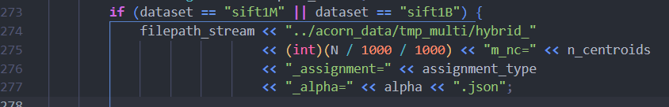

## ACORN代码修改进度记录

### 2025-3-2 整理代码
#### 1. 解析参数
共6个：
N=1000000 
gamma=12 
dataset=sift1M
M=32 
M_beta=64
efs=100（run_more_efs.sh中可以设置范围和步长）

#### 2.读入属性
整体属性：metadata_multi = load_ab_muti(dataset, n_centroids, assignment_type, N);
查询是必须有的属性：aq_multi=load_aq_multi
查询时尽量有的属性：oaq_multi=load_oaq_multi

> 读取的路径基本都是`filepath_stream << TESTING_DATA_MULTI_DIR <<"base_attrs_sift"<< (int)(N / 1000 / 1000) << "m_nc=" << n_centroids << "_assignment=" << assignment_type << ".json";`
需要提前将属性文件放到testing_data_multi中

#### 3.读取向量
- 读取查询向量：fvecs_read_first_n_vectors，其中文件名字来自：

- 读取base向量：fvecs_read，文件名字同上。

> 读取的路径是../acorn_data/Datasets/sift1M下的原始文件，需要提前将向量文件放到Datasets/sift1M中。

#### 4. 写入向量
写入到路径：

> 写入的路径是../acorn_data/tmp_multi/，需要提前建好文件夹。

#### 5. 查询向量
##### 5.1 计算距离并生成 JSON 文件
- generate_json=1：计算每个查询向量到所有base向量的距离calculate_distances_multi，存到all_distances中。然后调用save_distances_to_json存到文件夹../acorn_data/my_dis_of_every_query 中，共100个json文件，每个文件1000000行。
- generate_json=0：read_all_distances函数从../acorn_data/my_dis_of_every_query 中读取json文件。

> 生成并读取my_dis_of_every_query文件

##### 5.2 计算覆盖率并生成 JSON 文件
- generate_json=1：通过calculate_attribute_coverage计算覆盖率，并存到optional_coverage中。然后通过save_coverage_to_json存到../acorn_data/my_opattr_coverage中。
- generate_json=0：通过read_optional_coverage读取覆盖率到optional_coverage中。

> 生成并读取my_opattr_coverage文件

##### 5.3 计算cost
- generate_json=1：生成../acorn_data/my_cost文件
- generate_json=0：读取../acorn_data/my_cost文件

##### 5.4 计算recall
- extract_and_sort_costs：处理并提取符合要求的向量的 cost，并排序后存入 sort_filter_all_cost

### 2025-1-17
1. 更改了hnsw的多属性，但是recall很低。而且随着efs的更改，recall不能明显改善。莫非影响的参数不是efs？是不是应该改一改M或者属性的生成方式？
2. (已完成)绘制了efs从10到1000的图

### 2025-1-3
1. (已完成)查到的结果中出现很多Invalid row index，所以导致结果很差
--> bfs的时候，搜索所有点，但是仅仅将符合filter的点加入堆
2. (已完成)注意浮点数的比较，计算recall时候，使用误差1e-5

### 2024-12-31
1. (已完成)acorn的100次输出完全一样？
--> 发现计算的cost不同，但是输出的最短距离是一样的。查看是否是输入的cost是一样的。
--> 发现都是cost0.json中的数值
--> query_id 一直是0，所以只查了第0个
--> 循环或者删除query_id
--> 解决方案：query_id传参时候改成i
2. (已完成)写了dis、coverage、cost文件后，不用再计算了，改成需要读
3. (已完成)计算recall
--> 为什么这么低。。
--> 分母应该是符合必须包含的属性的要求的？(改了好一些了，但是recall=0.23左右)